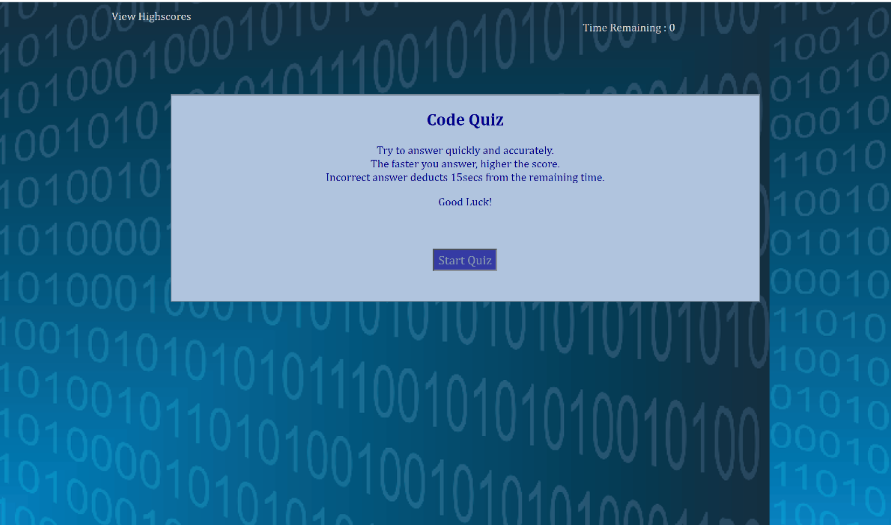

# Code-Quiz
This is the initial version of Javascript quiz app.

## Usage
There are 5 questions and 75 seconds to answer them.
The score entirely depends on the speed of answering.
The faster you answer, higher the speed.
If you answer incorrectly, you lose 15 secs from your time, which in turn negatively affects your final score.

# Deployed Link
[Code-Quiz](https://kulkdeepika.github.io/Code-Quiz)

## Credits
https://soundsilk.com/ was used to embed sounds to reflect right/wrong answers.

## Future enhancements:
Intent is to add more questions, provide the user with a couple of app theme options, etc.

